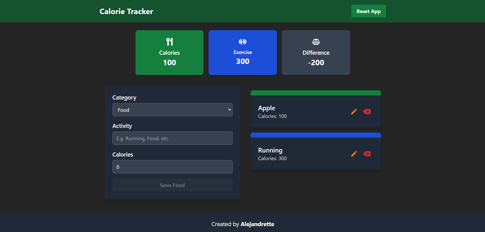
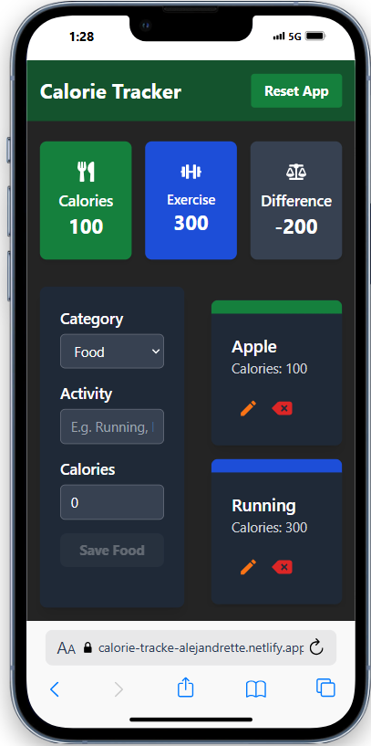

# 🥗 Calorie Tracker

Bienvenido a **Calorie Tracker**, una aplicación diseñada para ayudarte a monitorear tu ingesta calórica diaria y mantener un estilo de vida saludable. Esta herramienta es completamente **responsive** y utiliza tecnologías modernas de React para ofrecer una experiencia de usuario fluida y eficiente.

## 🚀 Demo en Vivo

Prueba la aplicación en vivo haciendo clic en el siguiente enlace:

[🔗 Demo en vivo](https://calorie-tracke-alejandrette.netlify.app/)

## ⚙️ Tecnologías Utilizadas

- **React** ⚛️: Biblioteca principal para construir la interfaz de usuario.
- **TypeScript** 📜: Para un tipado seguro y mejor mantenimiento del código.
- **Tailwind CSS** 🎨: Para un diseño moderno y adaptable.
- **Vite** ⚡: Herramienta de construcción rápida para proyectos web modernos.
- **React Icons** 🎯: Conjunto de iconos populares para mejorar la interfaz visual.

## 🌟 Características

- **Registro de Actividades 📝**  
  - Añade actividades diarias con detalles como nombre, categoría y calorías.
- **Categorización de Actividades 📂**  
  - Clasifica las actividades en categorías como "Alimentación" y "Ejercicio".
- **Cálculo de Calorías en Tiempo Real 🔄**  
  - Visualiza el consumo y quema de calorías al instante.
- **Interfaz Intuitiva y Minimalista 🖌️**  
  - Diseño limpio y moderno para una experiencia de usuario agradable.
- **Diseño Responsivo 📱**  
  - Adaptado para funcionar en dispositivos móviles, tabletas y computadoras de escritorio.

## 📦 Instalación y Uso

1. Clona el repositorio:  

```bash
  git clone https://github.com/alejandrette/calorie-tracker.git
```

2. Navega al directorio del proyecto:  

  ```bash
    cd calorie-tracker
  ```

3. Instala las dependencias:  

  ```bash
   npm install
  ```

4. Inicia la aplicación en modo desarrollo:  

  ```bash
   npm run dev
  ```

5. Abre `http://localhost:5173` en tu navegador para ver la aplicación en acción.

## 📱 Capturas de Pantalla

**Vista en Escritorio:**



**Vista en Móvil:**



## 🛠️ Cómo Funciona

1. **Añadir una Actividad:**  
   - Completa el formulario con el nombre de la actividad, selecciona la categoría y especifica las calorías.  
   - Haz clic en "Guardar" para registrar la actividad.

2. **Visualizar Actividades:**  
   - Las actividades registradas se muestran en una lista con detalles como nombre, categoría y calorías.

3. **Monitorear Calorías:**  
   - La sección de resumen muestra las calorías consumidas, quemadas y la diferencia neta.

## 🚀 Desarrollo Futuro

- **Gráficos de Progreso 📈** Visualizar el progreso de consumo y quema de calorías a lo largo del tiempo.
- **Sincronización con Dispositivos Wearables ⌚** Integración con dispositivos de seguimiento de actividad física.

## 👥 Contribuciones

Si deseas contribuir al proyecto, sigue estos pasos:

1. Haz un fork del repositorio.
2. Crea una nueva rama con una nueva funcionalidad:  

  ```bash
   git checkout -b feature/nueva-funcionalidad
  ```

3. Realiza tus cambios y súbelos:  

  ```bash
   git commit -m "Añadir nueva funcionalidad"
   git push origin feature/nueva-funcionalidad
  ```

4. Abre un Pull Request.
